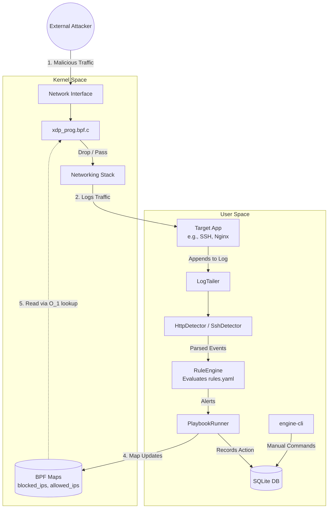

# Tier 3 Automated Intrusion Mitigation Engine (XDP)

A local, automated intrusion mitigation system bridging application logs with eBPF/XDP kernel dropping.
Detect from anywhere, enforce at kernel speed, respond with guardrails, record everything.

[](https://github.com/v1shad/xdp-engine/actions)


## Features

**Kernel (XDP)**
* Drops hostile IPv4 packets natively at the network driver level.
* Hardware/Software SYN rate limiting.
* Uses eBPF Hash Maps for `O(1)` IP blocklist lookups.
* Emits kernel-level packet drop events back to user space via BPF Ring Buffer.

**Detection**
* Parses `fake_auth.log` (SSH) and `fake_access.log` (HTTP).
* HTTP parser fully URL-decodes and caps paths to prevent memory exhaustion.
* Correlates logs using a sliding-window YAML rule engine.
* Supports Threshold rules (e.g., 5 SSH fails in 60s) and Sequence rules (e.g., Port Scan then SSH brute force).

**Response (SOAR)**
* Playbook engine runs actions: enrich, log, block, notify, approve.
* Tracks attacker escalation (offenses) to apply longer blocks for repeat offenders.
* Requires manual CLI approval (`engine-cli approve <alert_id>`) for extreme actions if configured.

**Observability**
* **SQLite Database**: Records every event, alert, and active block.
* **Flask Web Dashboard**: Read-only, real-time visualization of attacks, charts, and metrics.
* **Markdown Reports**: Generates full offline `report.md` snapshots of attacks.

**Safety Guardrails**
* Automatically sanitizes malformed UTF-8 sequences and control characters.
* Handles file deletion and rename-style log rotation gracefully.
* UNIX socket control channel strictly requires `root` privileges.
* Hardcoded allowlist bypass ensures `127.0.0.1` and admin IPs are never locked out.
* Blocks expire automatically using a timestamp (`blocked_until_ns`), unblocking inherently if the daemon crashes.

**Engineering**
* Fully containerized GitHub Actions CI pipeline.
* Built-in `AddressSanitizer` and `UndefinedBehaviorSanitizer` test suites.
* Deployable as a hardened `systemd` background service.
* Covered by massive `gtest` unit tests and bash-based Red Team fuzzing scripts.

## Architecture



| Component | File | Description |
|-----------|------|-------------|
| Kernel XDP | `xdp_prog.bpf.c` | BPF program compiled to byte code. Inspects IP headers and applies drops/rate limits. |
| Tailers & Detectors | `log_tailer.h`, `http_detector.cpp`, `engine.cpp` | Sleep-polling tailers safely ingest and decode application logs (SSH, Nginx). |
| Rule Engine | `rule_engine.cpp` | Parses incoming JSON events and executes sequence/threshold evaluation windows. |
| Playbook Runner | `playbook_runner.cpp` | Executes response actions like `block`, `notify`, or `approve` based on alerts. |
| Engine Core | `engine.cpp` | The `jthread` orchestrator bridging libbpf maps, the ring buffer, storage, and the local UNIX socket. |
| Dashboard | `dashboard/app.py` | Read-only Python UI polling the SQLite database for real-time visualization. |

## How it works (6 Steps)

1. **Log Line:** The daemon `LogTailer` safely ingests a new line appended to `/tmp/fake_access.log` and passes it to the `HttpDetector`.
2. **Event:** The detector strips invalid UTF-8, URL-decodes the path, applies standard Regex, and constructs an internal generic `Event` object containing the parsed `src_ip`.
3. **Rule:** The `RuleEngine` consumes the event into a sliding window. If the event breaks a threshold (e.g., 5 SSH fails in 60s), it generates an `Alert`.
4. **Playbook:** The `PlaybookRunner` matches the `Alert` to a response playbook in `playbooks.yaml`.
5. **Map Update:** The playbook executes a `block` action, pushing the `src_ip` and an expiry timestamp into the `blocked_ips` BPF Hash Map via `libbpf`.
6. **XDP Drop:** The in-kernel `xdp_prog.bpf.c` inspects incoming network packets, checks the map in `O(1)` time, executes `XDP_DROP`, and pushes a drop counter back to user space via the BPF Ring Buffer.

## Requirements

The project uses C++20 and eBPF.

**Fedora:**
```bash
[sudo] dnf install clang llvm libbpf-devel elfutils-libelf-devel zlib-devel yaml-cpp-devel sqlite-devel libcurl-devel gtest-devel
```

**Ubuntu / Debian:**
```bash
[sudo] apt install clang llvm libbpf-dev libelf-dev zlib1g-dev libyaml-cpp-dev libsqlite3-dev libcurl4-openssl-dev libgtest-dev nlohmann-json3-dev
```

**Check Kernel Capabilities:**
Ensure your kernel supports XDP:
```bash
uname -r
```

## Installation & Build

First, clone the repository:
```bash
git clone https://github.com/v1shad/xdp-engine.git
cd xdp-engine
```


```bash
make clean
make
```

Run the exhaustive 20-test C++ `gtest` suite:
```bash
make test
```

Run the `AddressSanitizer` memory leak and bounds verification suite:
```bash
make asan
./engine_asan veth-host ./xdp_prog.bpf.o /tmp/fake_auth.log
```

## Lab Setup

To safely test the engine, we use network namespaces to isolate the attacker traffic on a virtual interface (`veth-host`). 
Run the exact setup script provided:

```bash
[sudo] ./reset_demo.sh
```

## Running the Engine

You can run the engine in two ways. **Do not run both at the same time.**

### Manual Foreground Mode
```bash
[sudo] ./engine veth-host ./xdp_prog.bpf.o /tmp/fake_auth.log
```
The database will be created in your current working directory as `engine.db`.

### Systemd Background Service
To install the compiled engine into `/opt/xdp-engine` and run it silently in the background via systemd:
```bash
[sudo] ./install.sh
[sudo] systemctl status xdp-engine
```
The database will be created at `/opt/xdp-engine/engine.db`.

To launch the web dashboard pointing at the systemd database, override the `ENGINE_DB` variable:
```bash
ENGINE_DB=/opt/xdp-engine/engine.db python3 dashboard/app.py
```

## Configuration

### `rules.yaml`
Defines the detection sliding windows.

Example (Threshold Rule):
```yaml
- name: SSH_BRUTE_FORCE
  type: threshold
  match_type: ssh_failed
  threshold: 5
  window_seconds: 60
  severity: high
```

### `playbooks.yaml`
Defines the sequence of actions taken when an alert triggers. Actions include `enrich`, `notify`, `block`, `record`, and `approve`.

Example:
```yaml
SSH_BRUTE_FORCE:
  - step: enrich
  - step: block
  - step: notify
  - step: record
```

**Playbook Features:**
- **Escalation Ladder:** The engine tracks how many times an IP has offended and dynamically multiplies block durations for repeat offenders.
- **Allowlist:** `127.0.0.1` and IPs configured via the manual command-line tool are excluded from blocks entirely.
- **Approval Mode:** Replacing `- step: block` with `- step: approve` places the alert in a queue requiring a manual `engine-cli approve <id>` command before the kernel map is updated.

## Control

Control the engine using the secure `engine-cli` UNIX socket tool.

| Command | Action |
|---------|--------|
| `[sudo] ./engine-cli list` | List currently active blocked IPs and TTLs. |
| `[sudo] ./engine-cli stats` | Print drop, pass, and protocol statistics. |
| `[sudo] ./engine-cli alerts` | Print the last 10 generated alerts. |
| `[sudo] ./engine-cli block <ip>` | Manually add a 10-minute block for an IP. |
| `[sudo] ./engine-cli unblock <ip>` | Instantly remove a block from the kernel. |
| `[sudo] ./engine-cli allow <ip>` | Add an IP to the persistent allowlist. |
| `[sudo] ./engine-cli approve <id>` | Manually approve a pending action. |
| `[sudo] ./engine-cli limit <val>` | Dynamically update the SYN rate-limit threshold. |

## Demo and Red Team

To run the interactive automated demo against the background engine:

1. Reset the lab network and logs:
   ```bash
   [sudo] ./reset_demo.sh
   ```
2. Start the dashboard in a separate terminal and open `http://127.0.0.1:5000/?demo=1`.
3. Launch the automated red team attacks:
   ```bash
   [sudo] ./attack_scenarios.sh
   ```

**Attack Stages:**
| Stage | Attacker IP | Attack Type | Expected Engine Action |
|-------|-------------|-------------|------------------------|
| 1 | `10.10.0.2` | Port Scan + SSH Brute Force | Correlates `SCAN_THEN_BRUTE` sequence. **Blocked.** |
| 2 | `10.10.0.3` | Pure SSH Brute Force | Triggers `SSH_BRUTE_FORCE` threshold. **Blocked.** |
| 3 | `10.10.0.4` | SYN Flood | SYN packets violently dropped by kernel rate limiter (`rate_limit_exceeded`), but IP is **NOT banned**. Recovers automatically. |
| 4 | `10.10.0.5` | Malicious HTTP Payloads | Correlates SQLi, Path Traversal, and Scanner UAs into individual events. **Blocked.** |

**Fuzzing & Chaos Verification:**
Test the resilience of the C++ daemon against log rotation, path injections, memory corruption, and malformed UTF-8 data logic bombs:
```bash
[sudo] ./fuzz_logs.sh
```

**Final Acceptance Verification:**
Run the red-team acceptance checker to verify everything holds true:
```bash
[sudo] ./verify_phase6.sh
```

## Verifying Kernel Drops

To independently verify the engine is dropping traffic in the kernel:

1. Start listening on the interface using `tcpdump`:
   ```bash
   [sudo] tcpdump -n -i veth-host icmp
   ```
2. Block an IP:
   ```bash
   [sudo] ./engine-cli block 10.10.0.4
   ```
3. Attempt to ping from the namespace:
   ```bash
   [sudo] ip netns exec attacker ping -I 10.10.0.4 10.10.0.1
   ```
*Result: The ping fails, and `tcpdump` shows absolute silence because the XDP program dropped the packets before `tcpdump` (AF_PACKET) even saw them!*

Check the BPF maps manually:
```bash
[sudo] bpftool map dump name blocked_ips
```

## Security Design

The engine runs as `root` because it attaches BPF programs to network devices. Consequently, it employs strict defenses:
- Safe, non-shell URL decoding and log tailing.
- No dynamic shell executions (`system()` and `popen()` strictly banned).
- SQLite API parameterization ensures no SQL injection via log files.
- The `xdp_engine.sock` socket is hardened to `0600`, refusing non-root execution.
- BPF verifier ensures the kernel program cannot infinite-loop or access out-of-bounds memory.

**Bugs found and fixed by Red Teaming:**
* **UTF-8 Crash:** The fuzzer injected `\xff\xfe\xfd` into SSH logs. The Python dashboard and `nlohmann::json` threw unhandled exceptions, crashing the C++ daemon. **Fix:** Created `sanitize_utf8()` to strip malformed sequences and replaced throwing JSON handlers with standard `replace` routines.
* **Log Rotation Failure:** Truncating or deleting `/tmp/fake_auth.log` caused the daemon to stop tracking logs. **Fix:** Replaced naive `getline()` with a custom `LogTailer` that polls `stat()` and gracefully tracks inode changes and file truncation logic.
* **Dashboard DB Pathing:** The dashboard defaulted to `./engine.db` when the `systemd` unit used `/opt/xdp-engine/engine.db`. **Fix:** Modified `app.py` to read the `ENGINE_DB` environment variable, defaulting to `/opt/`.
* **Shell Execution:** `engine.cpp` used `popen()` to verify `ip link` XDP status, exposing a command injection vector if the interface name was compromised. **Fix:** Entirely stripped `popen()` and replaced it with a purely native `libbpf` `bpf_xdp_query()` function.

## Benchmarks

Measured on a local veth virtual interface using `hping3` floods:

| Scenario | RX Packets/Sec | Drop Packets/Sec | System CPU % |
|----------|----------------|------------------|--------------|
| Baseline | 220,252        | 0                | 5%           |
| Iptables (Filter)| 356,405| 389,899          | 5%           |
| Iptables (Raw) | 663,597  | 728,995          | 5%           |
| XDP (xdp) | 543,195       | 495,016          | 5%           |

*Note: These benchmarks reflect virtual `veth` interfaces under extremely synthetic conditions. Iptables (Raw) and XDP perform similarly within noise thresholds. They do not demonstrate orders-of-magnitude gains achievable on real physical NICs with XDP driver offloading.*

## Limitations and Future Work

- **IPv4 Only:** The BPF program does not parse IPv6 or VLAN headers.
- **Spoofed-Source SYN Floods:** Spoofed IP floods will trigger rate limits, but the engine inherently cannot permanently ban arbitrary spoofed IPs safely.
- **Tested on Veth Only:** The engine is built for educational demonstration and has only been tested on `veth` interfaces.
- **Unbounded Event Retention:** The `events` SQLite table grows forever. There is no automated data lifecycle/cleanup query configured.
- **No Encrypted Payload Inspection:** As it operates directly on IP packets and parses static application log files, it cannot actively inspect TLS/HTTPS payloads in transit.

## Troubleshooting

| Problem | Cause / Solution |
|---------|------------------|
| **Verifier Error** (`libbpf: prog 'xdp_drop': BPF program load failed`) | Ensure you compiled `xdp_prog.bpf.c` with `-O2`. The verifier rejects unoptimized BPF code. |
| **Attach Failed** (`operation not supported`) | Your kernel or driver does not support XDP. Try loading it in generic mode (`skb`). |
| **Permission Denied** (`/run/xdp_engine.sock`) | You must use `sudo` to run `engine-cli`. |
| **SELinux 203/EXEC** | The `install.sh` script forgot to run `restorecon`. Run `sudo restorecon -Rv /opt/xdp-engine`. |
| **Stale Socket** (`Address already in use`) | The previous engine crashed and left `/run/xdp_engine.sock` behind. Delete it manually. |
| **Blocked IP persisting after restart** | The engine loads persistent state from the DB on boot. Run `sudo ./engine-cli unblock <ip>`. |
| **Dashboard showing old data** | The dashboard is hard-polling an old local DB instead of the systemd DB. Check your `ENGINE_DB` environment variable. |

## Project Layout

* `xdp_prog.bpf.c`: The eBPF kernel program.
* `engine.cpp`: The main C++ user space orchestrator daemon.
* `rule_engine.cpp`: The sliding-window logic engine.
* `playbook_runner.cpp`: The response escalation engine.
* `http_detector.cpp`: Nginx `fake_access.log` HTTP parser.
* `storage.cpp`: SQLite database and metrics persistence logic.
* `engine-cli.cpp`: Secure UNIX socket console tool.
* `rules.yaml` / `playbooks.yaml`: Engine configuration maps.
* `dashboard/app.py`: Flask dashboard frontend.
* `attack_scenarios.sh`: Red-team demo orchestration script.
* `fuzz_logs.sh`: Memory, rotation, and logic fuzzer script.
* `reset_demo.sh`: Network namespace lab recreation script.
* `install.sh`: Systemd deployment configuration script.

## Safety Notice
**Do not run this on production servers.**
This engine is built strictly for educational use and demonstration. Attach it *only* to the provided isolated laboratory virtual interface (`veth-host`). Only test software on networks and machines that you explicitly own.

## AI Assistance & License
This project was co-authored with the assistance of advanced AI coding agents for educational exploration into eBPF and C++20 memory safety.

Licensed under the GPL v2 License.
