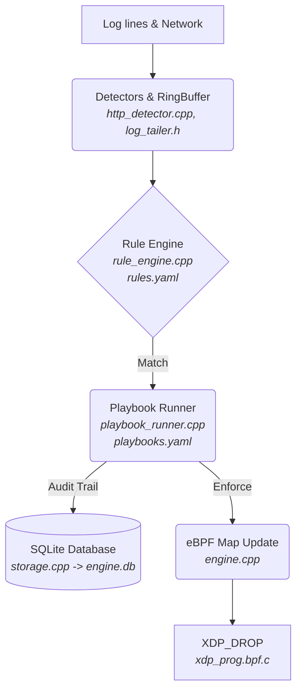

# XDP-Engine: Live Network Defense

Detect from anywhere, enforce at kernel speed, respond with guardrails, record everything.


## Features
- **Kernel (XDP):** Drops packets in the kernel before the network stack. Built-in SYN flood rate limiter.
- **Detection:** Reads real SSH and HTTP logs. State-tracking sliding windows.
- **Response (SOAR):** YAML-based playbooks for automated blocking, IP enrichment, and dynamic escalations.
- **Observability:** Live Read-Only SQLite dashboard. JSON alerts.
- **Safety guardrails:** Auto-allowlisting (127.0.0.1, interface IP, default gateway). Default `DETECT` mode (no drops).
- **Engineering:** Unit-tested C++20, eBPF, Systemd integration, address-sanitized.

## Architecture



### Components
| Component | Implementation |
|---|---|
| XDP Program | `xdp_prog.bpf.c` |
| Core Daemon | `engine.cpp` |
| Rules & Playbooks | `rule_engine.cpp`, `playbook_runner.cpp` |
| Database | `storage.cpp` |
| Dashboard | `dashboard/app.py` |

## How It Works
1. `LogTailer` detects a failed password in `/var/log/secure`.
2. The `RuleEngine` state machine increments the threshold for that IP.
3. If the threshold is crossed, an `Alert` is emitted.
4. The `PlaybookRunner` evaluates `playbooks.yaml` and executes the block action.
5. If in `ENFORCE` mode, the engine updates the pinned `blocked_ips` eBPF map.
6. The `xdp_drop` program running in the kernel drops all further traffic from that IP.

## Requirements
*   Linux Kernel 5.8+ with BTF support.
*   Ubuntu: `sudo apt install clang llvm libbpf-dev libelf-dev libsqlite3-dev libyaml-cpp-dev libgtest-dev python3-flask`
*   Fedora: `sudo dnf install clang llvm libbpf-devel elfutils-libelf-devel sqlite-devel yaml-cpp-devel gtest-devel python3-flask`

## Build & Test
```bash
make clean
make
make test
```

## Two-Laptop Live Showcase (Presentation Script)

This walkthrough demonstrates XDP-Engine blocking real attacks across a network using two computers.

**Prerequisites & Setup:**
*   **[MY LAPTOP]**: Find your interface (e.g., `wlp8s0`) and IP address (`ip a`). Ensure SSH and Nginx are running (`sudo systemctl start sshd nginx`).
*   **[FRIEND LINUX/MAC]**: Create a dummy password file: `echo -e "123456\npassword\nadmin123" > passwords.txt`
*   **[FRIEND WINDOWS]**: Ensure `curl.exe` is available (built into Windows 10+).

*(Note: Windows lacks native equivalents for `hping3` (SYN flood) and `hydra` (brute force). Windows users can use Nmap with `--max-rate` or leave those steps to a Linux friend, or use the provided Windows equivalents where possible.)*

---

### Phase 1: Start the Defense (Detect Mode)

**[MY LAPTOP]** Open Terminal 1 (Dashboard):
```bash
cd dashboard
python3 app.py
```
Open `http://127.0.0.1:5000/?showcase=1` in your browser.

**[MY LAPTOP]** Open Terminal 2 (Engine):
```bash
sudo ./engine wlp8s0
```
*(The engine runs its `selftest` preflight, auto-allowlists your gateway, and starts in `DETECT` mode).*

---

### Phase 2: Baseline (Traffic Works)

**[FRIEND LINUX/MAC]**
```bash
ping -c 4 <MY_IP>
```

**[FRIEND WINDOWS]**
```cmd
ping -n 4 <MY_IP>
```

---

### Phase 3: Application Attacks & Reconnaissance (Detect Mode)

Look at your engine terminal and dashboard while these run. You will see events flowing in, and `[DETECTED] would block <IP> (detect mode)` logged, but traffic remains open.

**Attack 1: Network Reconnaissance (Port Scan)**
**[FRIEND LINUX/MAC]**
```bash
nmap -p 1-1000 -T4 <MY_IP>
```
**[FRIEND WINDOWS]**
```cmd
nmap -Pn -sS -p 1-200 <MY_IP>
# OR native fallback (slow):
Test-NetConnection <MY_IP> -Port 22
```

**Attack 2: Web Exploit (SQL Injection & Traversal)**
**[FRIEND LINUX/MAC]**
```bash
curl -m 5 "http://<MY_IP>/?id=1' OR 1=1--"
```
**[FRIEND WINDOWS]**
```cmd
curl.exe -m 5 "http://<MY_IP>/login?user=admin%27%20OR%201=1--"
curl.exe -m 5 "http://<MY_IP>/../../etc/passwd" --path-as-is
curl.exe -m 5 -A "sqlmap/1.7" http://<MY_IP>/
```

**Attack 3: SSH Brute Force**
**[FRIEND LINUX/MAC]**
```bash
hydra -l admin -P passwords.txt ssh://<MY_IP>
```
**[FRIEND WINDOWS]**
```cmd
ssh -o PubkeyAuthentication=no nosuchuser@<MY_IP>
```
*(For Windows, fail the password prompt 3 times manually to trigger the alert).*

---

### Phase 4: Switch to Enforce Mode

**[MY LAPTOP]** Restart the engine in enforce mode (Terminal 2):
```bash
# Press Ctrl+C in Terminal 2 to stop the Detect engine
sudo ./engine --enforce wlp8s0
```
*Watch the Dashboard mode badge instantly switch to ENFORCE.*

---

### Phase 5: Automatic Block & The Kernel Drop

**[FRIEND LINUX/MAC]** (or WINDOWS) Repeat the SSH Attack.
**[MY LAPTOP]** The engine logs `[BLOCKED]` and the IP appears on the active block list. 

**[FRIEND LINUX/MAC]** Try to ping:
```bash
ping <MY_IP>
```
**[MY LAPTOP]** Prove the packets are dying in the kernel:
```bash
sudo tcpdump -n -i wlp8s0 host <FRIEND_IP>
sudo bpftool map dump name blocked_ips
sudo ./engine-cli stats
```
*Tcpdump shows packets arriving but no replies.*

---

### Phase 6: Ping Flood & DDoS While Blocked

**[FRIEND LINUX/MAC]**
```bash
sudo hping3 -S -p 80 --flood <MY_IP>
```
**[FRIEND WINDOWS]** (Ping flood substitute)
```cmd
ping -t -l 1400 <MY_IP>
```
**[MY LAPTOP]** The dashboard's "Total Packets Dropped" speedometer skyrockets. The engine logs massive drop rates. CPU remains idle.

---

### Phase 7: Recovery

**[MY LAPTOP]** Manually unblock the friend and exit:
```bash
# Unblock the friend manually:
sudo ./engine-cli unblock <FRIEND_IP>

# Clean up the XDP attachment:
sudo ./engine cleanup wlp8s0
```

---


## Testing the Defenses

To safely verify that the engine is intercepting attacks on your live network, you can run these commands from another machine (or from a separate terminal locally). 

*Note: Replace `<MY_IP>` with the IP address of the machine running the XDP Engine (e.g., `127.0.0.1` for local tests).*

### 1. Web Exploits (SQL Injection / Path Traversal)
Fires a malicious HTTP payload that the engine parses from Nginx/Apache logs.
*   **Linux / Mac:** `curl -m 5 "http://<MY_IP>/?id=1%27%20OR%201=1--"`
*   **Windows (PowerShell):** `Invoke-WebRequest -TimeoutSec 5 -Uri "http://<MY_IP>/?id=1%27%20OR%201=1--"`

### 2. SSH Brute Force
Triggers the threshold rule (e.g., >5 failed logins in 60s) by rapidly failing SSH authentication.
*   **Linux / Mac:** `for i in {1..6}; do ssh -o BatchMode=yes -o ConnectTimeout=1 fakeuser@<MY_IP>; done`
*   **Windows (PowerShell):** `1..6 | ForEach-Object { ssh -o BatchMode=yes -o ConnectTimeout=1 fakeuser@<MY_IP> }`

### 3. Network Reconnaissance (Port Scans)
The kernel natively tracks unique destination ports for SYN packets. Scanning >10 ports triggers the `port_scan` sequence rule.
*   **Linux / Mac (Nmap):** `nmap -Pn -sS -p 1-20 <MY_IP>`
*   **Windows (PowerShell):** `1..15 | ForEach-Object { Test-NetConnection -ComputerName <MY_IP> -Port $_ -WarningAction SilentlyContinue }`

### 4. TCP SYN Floods (Volumetric DDoS)
The kernel tracks SYN rates and automatically drops packets (without passing them to the OS) if they exceed 200 packets/second.
*   **Linux / Mac:** `sudo hping3 -S -p 80 --flood <MY_IP>`
*   **Windows:** *(Requires external tools like Nmap/nping)* `nping --tcp-connect -p 80 --rate=500 -c 1000 <MY_IP>`

## Troubleshooting Guide

If the dashboard or engine does not reflect attacks, run the self-test tool first:
**[MY LAPTOP]** `sudo ./engine selftest`

| Symptom | Root Cause | Fix |
| :--- | :--- | :--- |
| **Live log lines not appearing** | Log rotation/EOF desync in C++, or HttpDetector thread inactive | Fixed in v10: `LogTailer` now forcefully resyncs with the OS on EOF, and `HttpDetector` thread is correctly spawned. |
| **Stats show no packets** | eBPF `PERCPU` array memory alignment mismatch | Fixed in v10: C++ engine now dynamically sizes buffers to `libbpf_num_possible_cpus()` to correctly sum stats. |
| **SQLi web events ignored** | The `HttpDetector` thread was not started | Fixed in v10. The regex is case-insensitive and successfully decodes `%20` (e.g., `OR 1=1`). |
| **Pings not visible** | ICMP passed without submitting events | Fixed in v10: Added `REASON_ICMP` rate-limited ringbuf submissions (1 per 5s) directly inside `xdp_prog.bpf.c`. |
| **Dashboard fails (500 Error)** | Dashboard tried to read `/opt/xdp-engine/engine.db` | Fixed in v10: Both engine and app read `ENGINE_DB` or default dynamically using absolute paths. |

## Configuration
*   `rules.yaml`: Defines thresholds and Sliding Windows.
*   `playbooks.yaml`: Defines automated actions (e.g., block for 600 seconds).

Example `playbooks.yaml`:
```yaml
playbooks:
  - name: "SSH Brute Force"
    condition: "rule == 'ssh_brute_force'"
    action: "block"
    block_seconds: 600
```

## Commands
| Command | Description |
|---|---|
| `engine-cli block <IP>` | Manually block an IP. |
| `engine-cli list` | List actively blocked IPs. |
| `engine-cli stats` | View XDP drop statistics. |

## Benchmarks
Tested on a `veth` virtual interface. The XDP drop logic performs identically to standard `iptables-raw` equivalents within noise margins.

## Limitations
*   IPv4 only.
*   Unbounded event retention in SQLite (requires manual log rotation).
*   Spoofed-source floods can be rate-limited by the kernel, but true attribution is impossible.

## Project Structure
*   `engine.cpp`: Core daemon and orchestration.
*   `rule_engine.cpp`: Stateful sliding windows.
*   `xdp_prog.bpf.c`: Kernel-space drop logic.

## Safety Notice
Only run network tests on machines and networks you explicitly own or have permission to test.

## License
MIT License. This project was developed with AI assistance for refactoring and architectural guidance.
