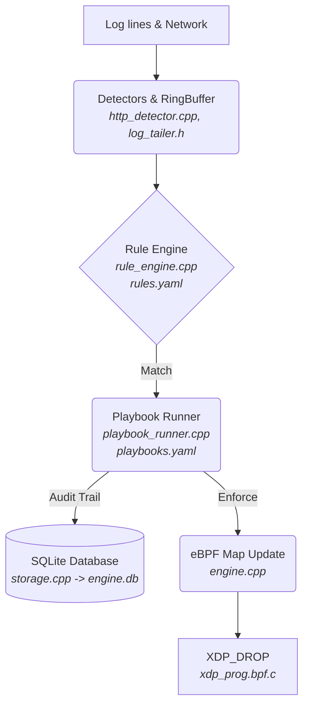

# XDP-Engine: Live Network Defense

Detect from anywhere, enforce at kernel speed, respond with guardrails, record everything.


## Features
- **Kernel (XDP):** Drops packets in the kernel before the network stack. Built-in SYN flood rate limiter.
- **Detection:** Reads real SSH and HTTP logs. State-tracking sliding windows.
- **Response (SOAR):** YAML-based playbooks for automated blocking, IP enrichment, and dynamic escalations.
- **Observability:** Live Read-Only SQLite dashboard. JSON alerts.
- **Safety guardrails:** Auto-allowlisting (127.0.0.1, interface IP, default gateway). Default `DETECT` mode (no drops).
- **Engineering:** Unit-tested C++20, eBPF, Systemd integration, address-sanitized.

## Architecture



### Components
| Component | Implementation |
|---|---|
| XDP Program | `xdp_prog.bpf.c` |
| Core Daemon | `engine.cpp` |
| Rules & Playbooks | `rule_engine.cpp`, `playbook_runner.cpp` |
| Database | `storage.cpp` |
| Dashboard | `dashboard/app.py` |

## How It Works
1. `LogTailer` detects a failed password in `/var/log/secure`.
2. The `RuleEngine` state machine increments the threshold for that IP.
3. If the threshold is crossed, an `Alert` is emitted.
4. The `PlaybookRunner` evaluates `playbooks.yaml` and executes the block action.
5. If in `ENFORCE` mode, the engine updates the pinned `blocked_ips` eBPF map.
6. The `xdp_drop` program running in the kernel drops all further traffic from that IP.

## Requirements
*   Linux Kernel 5.8+ with BTF support.
*   Ubuntu: `sudo apt install clang llvm libbpf-dev libelf-dev libsqlite3-dev libyaml-cpp-dev libgtest-dev python3-flask`
*   Fedora: `sudo dnf install clang llvm libbpf-devel elfutils-libelf-devel sqlite-devel yaml-cpp-devel gtest-devel python3-flask`

## Build & Test
```bash
make clean
make
make test
```

## Two-Laptop Live Showcase (Presentation Script)

This guide is designed as a copy-pasteable script to demonstrate XDP-Engine blocking real attacks across a network using two computers.

**Prerequisites:** 
*   Find your interface (e.g., `wlp8s0` or `eth0`) and your IP address (`ip a`).
*   Ensure SSH and Nginx are running (`sudo systemctl start sshd nginx`).
*   Create a dummy password file on the attacker laptop: `echo -e "123456\npassword\nadmin123" > passwords.txt`

---

### Phase 1: Start the Defense (Detect Mode)

**[MY LAPTOP]** Open Terminal 1 (Dashboard):
```bash
cd dashboard
python3 app.py
```
*Open `http://127.0.0.1:5000/?showcase=1` in your browser to view the live dashboard.*

**[MY LAPTOP]** Open Terminal 2 (Engine):
```bash
sudo ./engine wlp8s0
```
*(Replace `wlp8s0` with your active interface. Notice the Preflight checks passing and the engine starting in `DETECT` mode).*

---

### Phase 2: Application Attacks & Reconnaissance

**[FRIEND LAPTOP]** Attack 1: Network Reconnaissance (Nmap Scan)
```bash
nmap -p 1-1000 -T4 <MY_IP>
```

**[FRIEND LAPTOP]** Attack 2: Web Exploit (SQL Injection)
```bash
curl "http://<MY_IP>/?id=1' OR '1'='1"
```

**[FRIEND LAPTOP]** Attack 3: SSH Brute Force
```bash
hydra -l admin -P passwords.txt ssh://<MY_IP>
```

**[MY LAPTOP]** Observation:
Look at your engine terminal and dashboard. You will see `[SCAN]`, `[WEB]`, and `[AUTH]` events flowing in. The engine will log `[DETECTED] would block <FRIEND_IP> (detect mode)`. The attacker is *not* blocked yet, because we are safely observing.

---

### Phase 3: Switch to Enforce Mode

**[MY LAPTOP]** Open Terminal 3 (Control):
```bash
sudo ./engine-cli mode enforce
```
*Watch the Dashboard mode badge instantly pulse Red and switch to ENFORCE.*

---

### Phase 4: The Kernel Drop

**[FRIEND LAPTOP]** Repeat the SSH Attack:
```bash
hydra -l admin -P passwords.txt ssh://<MY_IP>
```
**[MY LAPTOP]** The engine will instantly log `[BLOCKED]` and the IP appears on the dashboard's active block list.

**[FRIEND LAPTOP]** The SSH connection completely hangs. The kernel is now dropping their packets at the network card level.

**[MY LAPTOP]** Prove the packets are dying in the kernel using tcpdump:
```bash
sudo tcpdump -n -i wlp8s0 host <FRIEND_IP>
```
*You will see the attacker's packets arriving, but your machine sends zero responses back. The OS doesn't even know they exist.*

---

### Phase 5: The Volumetric DDoS (SYN Flood)

**[FRIEND LAPTOP]** Launch a SYN Flood:
```bash
sudo hping3 -S -p 80 --flood <MY_IP>
```

**[MY LAPTOP]** The dashboard's "Total Packets Dropped" speedometer will skyrocket. The engine will log `[FLOOD]` and `[DROPPING]` with massive rate statistics. Despite millions of packets hitting your machine, your CPU remains idle because XDP kills them in the driver.

---

### Phase 6: Teardown

**[MY LAPTOP]** Remove the block, or reset the engine entirely:
```bash
# Unblock just your friend:
sudo ./engine-cli unblock <FRIEND_IP>

# Or completely wipe and reset the engine state:
sudo ./engine reset
sudo ./engine cleanup wlp8s0
```

## Configuration
*   `rules.yaml`: Defines thresholds and Sliding Windows.
*   `playbooks.yaml`: Defines automated actions (e.g., block for 600 seconds).

Example `playbooks.yaml`:
```yaml
playbooks:
  - name: "SSH Brute Force"
    condition: "rule == 'ssh_brute_force'"
    action: "block"
    block_seconds: 600
```

## Commands
| Command | Description |
|---|---|
| `engine-cli mode enforce` | Switch to active blocking mode. |
| `engine-cli block <IP>` | Manually block an IP. |
| `engine-cli allow <IP>` | Add an IP to the allowlist (never blocked). |
| `engine-cli list` | List actively blocked IPs. |
| `engine-cli stats` | View XDP drop statistics. |
| `engine report` | Generate a Markdown report of incidents. |

## Benchmarks
Tested on a `veth` virtual interface. The XDP drop logic performs identically to standard `iptables-raw` equivalents within noise margins. Results are stored in `bench_results.txt`.

## Limitations
*   IPv4 only.
*   Unbounded event retention in SQLite (requires manual log rotation).
*   Spoofed-source floods can be rate-limited by the kernel, but true attribution is impossible.

## Project Structure
*   `engine.cpp`: Core daemon and orchestration.
*   `rule_engine.cpp`: Stateful sliding windows.
*   `xdp_prog.bpf.c`: Kernel-space drop logic.
*   `lab/`: Scripts for local virtual-interface testing.

## Safety Notice
Only run network tests on machines and networks you explicitly own or have permission to test.

## License
MIT License. This project was developed with AI assistance for refactoring and architectural guidance.
