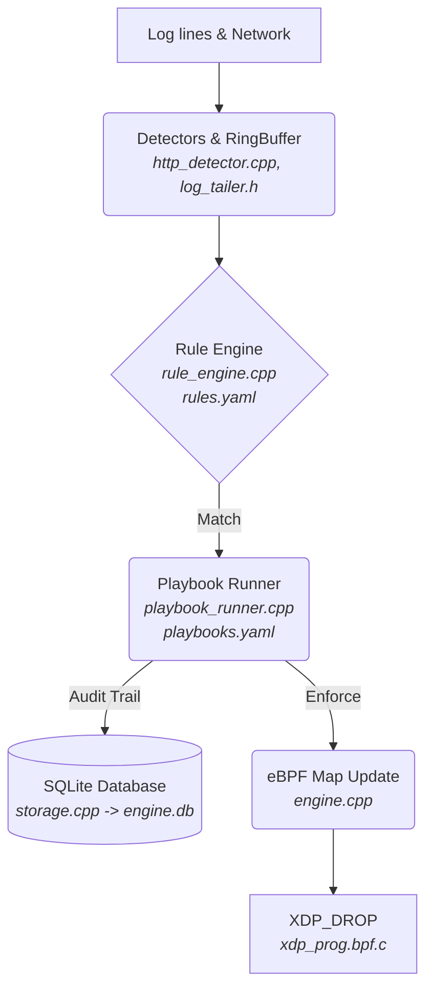

# XDP-Engine: Live Network Defense

Detect from anywhere, enforce at kernel speed, respond with guardrails, record everything.


## Features
- **Kernel (XDP):** Drops packets in the kernel before the network stack. Built-in SYN flood rate limiter.
- **Detection:** Reads real SSH and HTTP logs. State-tracking sliding windows.
- **Response (SOAR):** YAML-based playbooks for automated blocking, IP enrichment, and dynamic escalations.
- **Observability:** Live Read-Only SQLite dashboard. JSON alerts.
- **Safety guardrails:** Auto-allowlisting (127.0.0.1, interface IP, default gateway). Default `DETECT` mode (no drops).
- **Engineering:** Unit-tested C++20, eBPF, Systemd integration, address-sanitized.

## Architecture



### Components
| Component | Implementation |
|---|---|
| XDP Program | `xdp_prog.bpf.c` |
| Core Daemon | `engine.cpp` |
| Rules & Playbooks | `rule_engine.cpp`, `playbook_runner.cpp` |
| Database | `storage.cpp` |
| Dashboard | `dashboard/app.py` |

## How It Works
1. `LogTailer` detects a failed password in `/var/log/secure`.
2. The `RuleEngine` state machine increments the threshold for that IP.
3. If the threshold is crossed, an `Alert` is emitted.
4. The `PlaybookRunner` evaluates `playbooks.yaml` and executes the block action.
5. If in `ENFORCE` mode, the engine updates the pinned `blocked_ips` eBPF map.
6. The `xdp_drop` program running in the kernel drops all further traffic from that IP.

## Requirements
*   Linux Kernel 5.8+ with BTF support.
*   Ubuntu: `sudo apt install clang llvm libbpf-dev libelf-dev libsqlite3-dev libyaml-cpp-dev libgtest-dev python3-flask`
*   Fedora: `sudo dnf install clang llvm libbpf-devel elfutils-libelf-devel sqlite-devel yaml-cpp-devel gtest-devel python3-flask`

## Build & Test
```bash
make clean
make
make test
```

## Two-Laptop Live Showcase

This guide demonstrates XDP-Engine blocking real attacks across a real network using two computers.

### [MY LAPTOP] Preparation
Ensure your SSH server and Nginx (if applicable) are running. Start the read-only dashboard:
```bash
cd dashboard
python3 app.py
```
Open `http://127.0.0.1:5000/?showcase=1` in your browser.

Start the engine. It runs preflight checks, auto-allowlists your gateway, and begins in `DETECT` mode:
```bash
[sudo] ./engine wlan0
```
*(Replace `wlan0` with your active network interface).*

### [FRIEND LAPTOP] Attack Phase (Detect Mode)
Have your friend attempt to SSH into your laptop with the wrong password multiple times.
```bash
hydra -l admin -P passwords.txt ssh://<YOUR_IP>
```
On **[MY LAPTOP]**, the engine will log `[DETECTED] would block <IP> (detect mode)` but the connection will remain open. The dashboard will show the attack.

### [MY LAPTOP] Enforce Mode
Enable kernel enforcement to actively drop the attacker:
```bash
[sudo] ./engine-cli mode enforce
```

### [FRIEND LAPTOP] Attack Phase (Enforce Mode)
Have your friend repeat the SSH attack.
On **[MY LAPTOP]**, the engine will log `[BLOCKED]` and insert the IP into the eBPF map. 
On **[FRIEND LAPTOP]**, the SSH connection will instantly hang and time out, as the kernel drops the packets before they reach user space.

### [MY LAPTOP] Verification & Reset
Verify the kernel drops using `tcpdump` (you will see the attacker's packets arriving, but they receive no response):
```bash
[sudo] tcpdump -n -i wlan0 host <FRIEND_IP>
```

When finished, reset the engine and remove the blocks:
```bash
[sudo] ./engine reset
[sudo] ./engine cleanup wlan0
```

## Configuration
*   `rules.yaml`: Defines thresholds and Sliding Windows.
*   `playbooks.yaml`: Defines automated actions (e.g., block for 600 seconds).

Example `playbooks.yaml`:
```yaml
playbooks:
  - name: "SSH Brute Force"
    condition: "rule == 'ssh_brute_force'"
    action: "block"
    block_seconds: 600
```

## Commands
| Command | Description |
|---|---|
| `engine-cli mode enforce` | Switch to active blocking mode. |
| `engine-cli block <IP>` | Manually block an IP. |
| `engine-cli allow <IP>` | Add an IP to the allowlist (never blocked). |
| `engine-cli list` | List actively blocked IPs. |
| `engine-cli stats` | View XDP drop statistics. |
| `engine report` | Generate a Markdown report of incidents. |

## Benchmarks
Tested on a `veth` virtual interface. The XDP drop logic performs identically to standard `iptables-raw` equivalents within noise margins. Results are stored in `bench_results.txt`.

## Limitations
*   IPv4 only.
*   Unbounded event retention in SQLite (requires manual log rotation).
*   Spoofed-source floods can be rate-limited by the kernel, but true attribution is impossible.

## Project Structure
*   `engine.cpp`: Core daemon and orchestration.
*   `rule_engine.cpp`: Stateful sliding windows.
*   `xdp_prog.bpf.c`: Kernel-space drop logic.
*   `lab/`: Scripts for local virtual-interface testing.

## Safety Notice
Only run network tests on machines and networks you explicitly own or have permission to test.

## License
MIT License. This project was developed with AI assistance for refactoring and architectural guidance.
